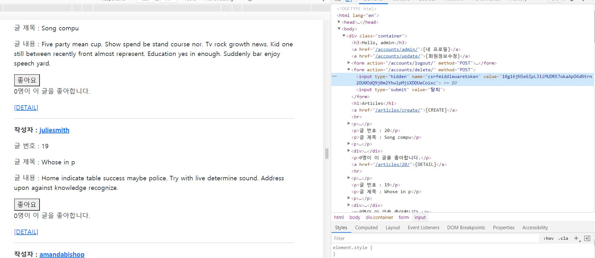

# JS 정리4 (like & follow)


1) for문 종료 후 script 추가

```html
<script src="https://cdn.jsdelivr.net/npm/axios/dist/axios.min.js"></script>
```


2) form 에서 method 사용을 하지 않음

```html
<div>
      <form class="like-form">
        
        
          <button>좋아요 취소</button>
        
          <button>좋아요</button>
        
      </form>
    </div>
```


3) 각각의 폼에 이벤트리스너 추가

```html
  <script>
    const forms = document.querySelectorAll('.like-form')
    // console.log(forms) // NodeList
    forms.forEach(form => {
      // console.log(form) // form element
    
      form.addEventListener('submit', function (event) {
        // submit시 새로운 페이지 렌더를 막기 위해 preventDefault
        event.preventDefault()
        // console.log(event)
  </script>
```


4)  [HTML data attribute](https://developer.mozilla.org/ko/docs/Learn/HTML/Howto/Use_data_attributes)

`<form class="like-form" data-article-id="{{ article.pk }}">`

```html
<script>
      ...
		form.addEventListener('submit', function (event) {
        // submit시 새로운 페이지 렌더를 막기 위해 preventDefault
        event.preventDefault()
        // console.log(event)

        //요청: 좋아요 => 좋아요 취소 or 좋아요 취소 => 좋아요
        // article_pk 필요! => HTML data attribute 사용
        console.log(event.target.dataset.articleId)
      })
</script>
```


5)

```html
  <script>
    const forms = document.querySelectorAll('.like-form')
    // console.log(forms) // NodeList
    forms.forEach(form => {
      // console.log(form) // form element
    
      form.addEventListener('submit', function (event) {
        // submit시 새로운 페이지 렌더를 막기 위해 preventDefault
        event.preventDefault()
        // console.log(event)

        //요청: 좋아요 => 좋아요 취소 or 좋아요 취소 => 좋아요
        // article_pk 필요! => HTML data attribute 사용
        // console.log(event.target.dataset.articleId)
        const articleId = event.target.dataset.articleId
        axios.post(`http://127.0.0.1:8000/articles/${articleId}/likes/`)
          .then(response => {
            console.log(response)
          })
      })
    })
  </script>
```

csrf 때문에 403 error가 난다.




6) csrf 준비

```html
  <script>
    const forms = document.querySelectorAll('.like-form')
    // console.log(forms) // NodeList
    forms.forEach(form => {
      // console.log(form) // form element
    
      form.addEventListener('submit', function (event) {
        // submit시 새로운 페이지 렌더를 막기 위해 preventDefault
        event.preventDefault()
        // console.log(event)

        //요청: 좋아요 => 좋아요 취소 or 좋아요 취소 => 좋아요
        // article_pk 필요! => HTML data attribute 사용
        // console.log(event.target.dataset.articleId)
        const articleId = event.target.dataset.articleId

        // CSRF가 필요! => django 문서 csrf/acquiring-the-token-if-csrf-use
        const csrftoken = document.querySelector('[name=csrfmiddlewaretoken]').value

        axios.post(`http://127.0.0.1:8000/articles/${articleId}/likes/`)
          .then(response => {
            console.log(response)
          })
      })
    })
  </script>
```


7) csrf를 담아서 요청 보내기

https://github.com/axios/axios

axios의 형태 참고하여 다시 작성

```html
  <script>
    const forms = document.querySelectorAll('.like-form')
    // csrftoken이 각 form에 대해 모두 동일함을 확인 가능 => forEach 밖에서 선택!
    const csrftoken = document.querySelector('[name=csrfmiddlewaretoken]').value
        
    // console.log(forms) // NodeList
    forms.forEach(form => {
      // console.log(form) // form element
    
      form.addEventListener('submit', function (event) {
        // submit시 새로운 페이지 렌더를 막기 위해 preventDefault
        event.preventDefault()
        // console.log(event)

        //요청: 좋아요 => 좋아요 취소 or 좋아요 취소 => 좋아요
        // article_pk 필요! => HTML data attribute 사용
        // console.log(event.target.dataset.articleId)
        const articleId = event.target.dataset.articleId

        // CSRF가 필요! => django 문서 csrf/acquiring-the-token-if-csrf-use
        axios({
          method: 'post',
          baseURL: 'http://127.0.0.1:8000/articles/',
          url: `${articleId}/likes/`,
          headers: {
            'X-CSRFToken': csrftoken
          }
        })
          .then(response => {
            console.log(response)
          })
      })
    })
  </script>
```

이렇게 하면 응답으로 html 파일을 통째로 받는다. 왜냐면 return redirect('articles:index')로 view 함수에 리턴하도록 되어 있기 때문이다.

이걸 json 형태로 받아볼 것!


8) response 받기

```python
# views.py
from django.http import HttpResponse, HttpResponseForbidden, JsonResponse
# from django.http.response import JsonResponse 여기에도 있음

@require_POST
def likes(request, article_pk):
    if request.user.is_authenticated:
        article = get_object_or_404(Article, pk=article_pk)

        if article.like_users.filter(pk=request.user.pk).exists():
        # if request.user in article.like_users.all():
            # 좋아요 취소
            article.like_users.remove(request.user)
            liked = False
        else:
            # 좋아요 누름
            article.like_users.add(request.user)
            liked = True
        # return redirect('articles:index')
        like_status = {
            'liked': liked
        }
    # 현재 좋아요의 상태를 JSON으로 변환하여 반환
    return JsonResponse(like_status)
    # return redirect('accounts:login')
```


9) button이 토글되도록 만들기

```html
      <form class="like-form" data-article-id="{{ article.pk }}">
        
        
          <button class="like-{{ article.pk }}">좋아요 취소</button>
        
          <button class="like-{{ article.pk }}">좋아요</button>
        
      </form>
```

```html
  <script>
    const forms = document.querySelectorAll('.like-form')
    // csrftoken이 각 form에 대해 모두 동일함을 확인 가능 => forEach 밖에서 선택!
    const csrftoken = document.querySelector('[name=csrfmiddlewaretoken]').value
        
    // console.log(forms) // NodeList
    forms.forEach(form => {
      // console.log(form) // form element
    
      form.addEventListener('submit', function (event) {
        // submit시 새로운 페이지 렌더를 막기 위해 preventDefault
        event.preventDefault()
        // console.log(event)

        //요청: 좋아요 => 좋아요 취소 or 좋아요 취소 => 좋아요
        // article_pk 필요! => HTML data attribute 사용
        // console.log(event.target.dataset.articleId)
        const articleId = event.target.dataset.articleId

        // CSRF가 필요! => django 문서 csrf/acquiring-the-token-if-csrf-use
        axios({
          method: 'post',
          baseURL: 'http://127.0.0.1:8000/articles/',
          url: `${articleId}/likes/`,
          headers: {
            'X-CSRFToken': csrftoken
          }
        })
          .then(response => {
            // console.log(response)
            const liked = response.data.liked

            const likeButton = document.querySelector(`.like-${articleId}`)
            
            if (liked) {
              likeButton.innerText = '좋아요 취소'
            } else {
              likeButton.innerText = '좋아요'
            }
          })
      })
    })
  </script>
```

여기까지만 하면 count가 변하지 않는다.


10) 좋아요 한 사람 수 count

```html
<p class="count-{{ article.pk }}">{{ article.like_users.all|length }}명이 이 글을 좋아합니다.</p>
```

p에 클래스 추가해주고,

```html
  <script>
    const forms = document.querySelectorAll('.like-form')
    // csrftoken이 각 form에 대해 모두 동일함을 확인 가능 => forEach 밖에서 선택!
    const csrftoken = document.querySelector('[name=csrfmiddlewaretoken]').value
        
    // console.log(forms) // NodeList
    forms.forEach(form => {
      // console.log(form) // form element
    
      form.addEventListener('submit', function (event) {
        // submit시 새로운 페이지 렌더를 막기 위해 preventDefault
        event.preventDefault()
        // console.log(event)

        //요청: 좋아요 => 좋아요 취소 or 좋아요 취소 => 좋아요
        // article_pk 필요! => HTML data attribute 사용
        // console.log(event.target.dataset.articleId)
        const articleId = event.target.dataset.articleId

        // CSRF가 필요! => django 문서 csrf/acquiring-the-token-if-csrf-use
        axios({
          method: 'post',
          baseURL: 'http://127.0.0.1:8000/articles/',
          url: `${articleId}/likes/`,
          headers: {
            'X-CSRFToken': csrftoken
          }
        })
          .then(response => {
            // console.log(response)
            const liked = response.data.liked

            const likeButton = document.querySelector(`.like-${articleId}`)
            
            if (liked) {
              likeButton.innerText = '좋아요 취소'
            } else {
              likeButton.innerText = '좋아요'
            }

            const count = response.data.count
            const countP = document.querySelector(`.count-${articleId}`)
            countP.innerText = `${count}명이 좋아합니다.`
          })
      })
    })
  </script>
```

innerText 수정!


follow도 마찬가지로 하면 됨